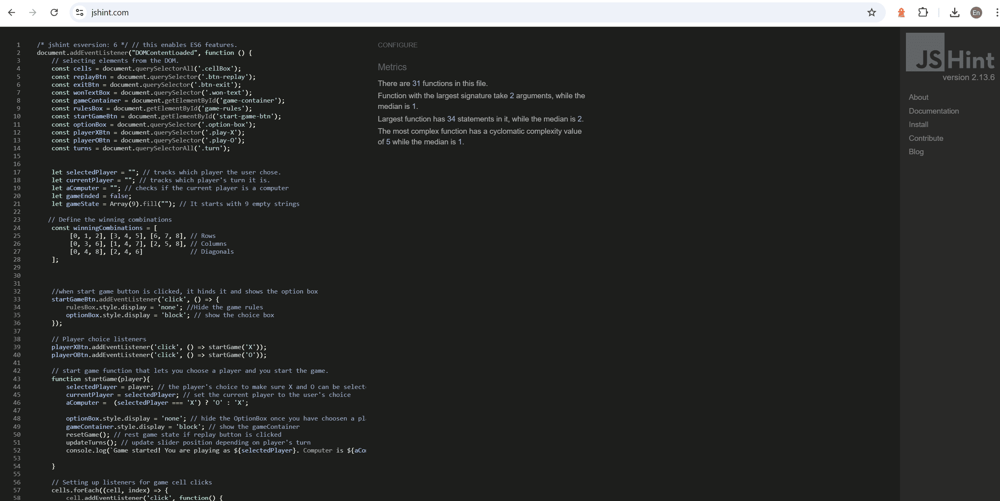

<h1 align="center">

  Brain Tic Tac Toe</h1>

[View the live project here](https://ein-1.github.io/Brain-Tic-Tac-Toe/)

**Brain Tic Tac Toe** is a fun and engaging game designed for two players. In this game, each player can choose to be **'X'** or **'O'**.

## How it is played

- Players take turns marking the spaces in a **3×3 grid**, with the objective of placing three of their marks in a horizontal, vertical, or diagonal row.
- Playing against the computer adds an additional layer of challenge, as the computer makes random moves, making it essential for the player to think strategically. The unpredictability of the computer's moves means you cannot rely on physical cues or expressions, adding to the fun and challenge.

## User's benefit

This game helps improve users reasoning and focus skills over time. As players continue playing, they develop better strategic thinking and problem-solving abilities. The more they engage with the game, the sharper their intelligence and focus skill becomes.

## Responsiveness

The game is designed to be responsive on different devices, allowing users to enjoy it on desktops, tablets, and smartphones.

You can find a demonstration of the game's responsiveness by clicking [here](https://ui.dev/amiresponsive?url=https://ein-1.github.io/Brain-Tic-Tac-Toe/).

# Index – Table of Contents
* [Design](#design)
* [Features](#features)
* [Testing](#testing)
* [Errors](#errors)
* [Technologies Used](#technologies-used)
* [Deployment](#deployment)
* [Credits](#credits)
* [Acknowledgments](#acknowledgments)

# Design
## View
- The game interface is centered in the middle of the screen, providing a balanced and focused user experience.
- The width of the elements is defined in percentages, and some media queries in CSS, ensuring that the layout is responsive across different screen sizes.

## Colour Scheme
- The colors chosen for this game were selected to create a visually appealing and accessible interface.

### Color Palette
Here are the colors used in the game:

1. **Deep Purple**: `#581296`  
   A rich, dark purple that serves as the primary color for the game.

2. **Bright Green**: `#40ED9F`  
   A vibrant green used for highlights and actionable buttons.

3. **Light Gray**: `#E1E0E0`  
   A subtle light gray that acts as a background color and for secondary UI elements.

4. **Black**: `#000000`  
   This classic black provides high contrast for text and essential interfaces.

### [Color Scheme](https://coolors.co/581296-40ed9f-e1e0e0-000000)

# Features
## Header

- The game consists of a logo on the left with "Brain Tic Tac Toe" prominently displayed in the center of the header, providing an excellent user interface.
- The logo and the name of the game clearly indicate that it is designed for intelligent players.

## Game Rules 

- This section outlines the game rules and explains how it is played. The game begins when the user clicks the **Start** button.

## Make a Choice

- The option box prompts the player to choose between Player (X) or Player (O) before the game starts.
- Once a user chooses a player, the game can only begin when the user clicks the corresponding button.

## Board Game

- Once a user wins, a message pops up indicating the winner, and if it’s a tie, it prompts the user with options to "Try Again" or acknowledge their loss—at which point the game is over.
- The user can click the **Replay** button to restart the game.

- The Replay button resets the game, allowing the user to start over without changing their initial role as an X-player or O-player.
- The user always has the chance to be the first player to choose a cell on the game board, after which the computer plays as either X or O, depending on the user's choice.

## View Winners or Draws

- Once the game is finished, players can choose to replay or exit the game.
- If they opt to **Replay**, the game resets.
- If they choose to **Exit**, they are returned to the game rules, giving them a chance to select a new player (either X or O) before starting a new game.

Below are the examples of how the game displays outcomes:

### Winning Results
- **O Results**  
  

- **X Results**  
  

### Draw Result
- **Draw Results**  
  

## Future Implementation

- I wish for the loser to have the opportunity to play first in the next round when the **Replay** button is clicked. This would provide a fair chance for all players and add excitement to the game.

- I plan to implement an option that allows users to choose to play with a friend or against the computer. Currently, the game defaults to a single-player mode against the computer, but adding a multiplayer mode would enhance the social experience and engagement.

# Testing

- Lighthouse desktop testing: 
  
- lighthouse mobile testing: 

## Validator Testing

- [HTML Checker](https://validator.w3.org/nu/?doc=https%3A%2F%2Fein-1.github.io%2FBrain-Tic-Tac-Toe%2F)

  
  - There are no errors or warnings found.

- [W3C CSS Validator](https://jigsaw.w3.org/css-validator/validator?uri=https%3A%2F%2Fein-1.github.io%2FBrain-Tic-Tac-Toe%2F&profile=css3svg&usermedium=all&warning=1&vextwarning=&lang=en)

  
  - There are no errors or warnings found.

- [JavaScript Validator](https://jshint.com/)
       
  
    - There are no errors found.

- [Web Accessibility Evaluation Tool Validator](https://wave.webaim.org/report#/https://ein-1.github.io/Brain-Tic-Tac-Toe/)
  
   - There are no errors, alerts or contrast errors found.

## Errors

- User choosing between player X OR O
    
  - `Initial error:`
  The computer was fixed as 'O' by default, making it difficult for the user to select 'O'. Even when the option box allowed the user to select 'Play O', the game logic did not respond correctly—allowing the user to make their second move before the computer could take action with 'X'.

  - `Fixed error:` This behavior was improved by implementing a new variable called aComputer which tracks the symbol that the computer takes after the user makes their selection. This ensures that the game flow is intuitive and that both the player and the computer can interact more directly. 

  Below is the Fixed Code:
      

- Hightlight color could not reset when Exit or Replay button is clicked
  

  - `Initial error:` 
  The highlight color was stuck on the game area cells, and even when the Replay or Exit buttons were clicked, the colors did not change. This meant that players could continue playing without a proper visual reset of the game state, making it confusing when starting a new game.
  - `Fixed error:`
  To resolve this issue, I set up code in the resetGame and endGame functions to clear all cell highlights whenever the Replay or Exit buttons are clicked. This ensures that when starting a new game or exiting to the rules, the game area is visually reset to its initial state.

Below is the Fixed Code:
    

## Browser Compatibility

    - Testing has been carried out on the following browsers :
    - Chrome (64-bit)
    - Firefox (64-bit)
    - Edge (64-bit)

# Technologies Used

## Languages Used
- [HTML5](https://en.wikipedia.org/wiki/HTML5)
- [CSS3](https://en.wikipedia.org/wiki/Cascading_Style_Sheets)
- [JavaScript](https://en.wikipedia.org/wiki/JavaScript)

## Libraries & Programs Used
- [Google Fonts](https://fonts.google.com/) was used to import the 'Familjen' and 'Grotesk' fonts into the style.css file.
- [Git](https://git-scm.com/) was used for version control by utilizing the Gitpod terminal to commit to Git and push to GitHub.
- [GitHub](https://github.com/) serves as the repository for the project's code after being pushed from Git.
- [iLoveIMG](https://www.iloveimg.com/) was used for resizing images.
- [Favicon](https://www.favicon.cc/) was used to add an icon in the browser.
- [LogoMaker](https://www.logomaker.net/) was used to create a logo for aesthetic and UX purposes.
- [Remove Image Background](https://www.remove.bg/) was used to remove the logo background.
- [Mockup Generator](https://ui.dev/amiresponsive?url=https://ein-1.github.io/Brain-Tic-Tac-Toe/) was used to test the game on different responsive devices.

# Deployment

## How This Site Was Deployed
- In the GitHub repository, navigate to the Settings tab, then choose Pages from the left-hand menu.
- From the branch section  select drop-down menu, select the Main Branch.
- Once the main branch has been selected, the page will automatically refresh with a detailed ribbon display to indicate the successful deployment.
- Any changes pushed to the master/ main branch will take effect on the live project.

The live link can be found here - [Brain Tic Tac Toe](https://ein-1.github.io/Brain-Tic-Tac-Toe/) 

## How to Clone the Repository
1. Go to the [GitHub Repository](https://github.com/EIN-1/Brain-Tic-Tac-Toe).
2. Click the `Code` button to the right of the screen, select HTTPS, and copy the link.
3. Open a Git Bash terminal and navigate to the directory where you want to clone the repository.
4. Type `git clone`, paste the copied URL, and press Enter to start the clone process.

# Credits 
- JavaScript: [Code Institute](https://youtu.be/n6gzxTsbHLc?si=aDJ1GpVS_6qi2efs)
- Code Hawk: [The Queen's Pawn](https://youtu.be/n6gzxTsbHLc?si=aDJ1GpVS_6qi2efs)
- A Complete Overview of JavaScript Events: [dcode](https://youtu.be/YiOlaiscqDY?si=wTdI2AmbCT6C8pmX)
- Game: [Bro Code](https://youtu.be/AnmwHjpEhtA?si=V_dSDNVMDIO-d6fQ)
- Color Palettes Generator: [Coolors](https://coolors.co/581296-40ed9f-e1e0e0-000000-000000)
- Color Contrast Checker: [Coolors](https://coolors.co/contrast-checker/581296-e1e0e0)
- JSHint Version Warnings: [JSHint Version Issue](https://youtu.be/QDzeU1FUZRk?si=hFpzXqylDbD5_o7K)
- JSHint Warning Version Issues: [StackOverflow](https://stackoverflow.com/questions/27441803/why-does-jshint-throw-a-warning-if-i-am-using-const)
- AmiResponsive: [Mockup Generator](https://ui.dev/amiresponsive?url=https://ein-1.github.io/Brain-Tic-Tac-Toe/)

## Content 
- Content for the game was based on:
  - [YouTube](https://www.youtube.com/)
  - [StackOverflow](https://stackoverflow.com/)
  - [Code Institute](https://learn.codeinstitute.net)
  - All other content was written by the developer.

## Code
- How to create a slider in CSS and JavaScript: [YouTube Videos on How to Build Tic Tac Toe](https://youtu.be/n6gzxTsbHLc?si=53Mkqg3-Gb_kX1qF)
- Tutorials on creating Tic Tac Toe: [YouTube Videos](https://www.youtube.com/)
- How to call functions: [Code Institute](https://codeinstitute.net)
- How to create a slider in CSS and JavaScript : [youtube videos on how to build tic tac toe](https://youtu.be/n6gzxTsbHLc?si=53Mkqg3-Gb_kX1qF)
- How to create tic tac toe videos from the ones I credited above : [youtube videos on how to build tic tac toe](https://www.youtube.com/)
- How to munipulate some function to do specific tasks : [W3Schools The inner Element Object](https://www.w3schools.com/jsref/tryit.asp?filename=tryjsref_node_textcontent_innerhtml_innertext)
- Tic Tac Toe - win highlighted : [codepen.io](https://codepen.io/farrukhhassan/pen/mjOxZO)
- How to create a Tic Tac Toe : [Canan Korkut](https://medium.com/@canankorkut1/how-to-create-a-tic-tac-toe-with-html-css-and-javascript-10a25fddd356)
- How to get players to take turns in JavaScript : [Stackoverflow](https://stackoverflow.com/questions/65351388/how-to-get-players-to-take-turns-in-javascript-tic-tac-toe-project)

## Media 

- The fonts used in the game were imported from [Google Fonts](https://fonts.google.com/).
- The favicon was created using [Favicon](https://www.favicon.cc/).
- The logo was designed using [LogoMaker](https://www.logomaker.net/).
- The logo image was resized using [iLoveIMG](https://www.iloveimg.com/).
- The logo background was removed using [Remove Image Background](https://www.remove.bg/).

# Acknowledgments

- I would like to express my gratitude to my cohort facilitator, Madam Kay Welfare, for always checking in on me during my course. I am thankful for the invaluable advice and feedback she provided on how to plan and execute this project. Her pointers on resources, including where to find colors, resizing images, and more, were immensely helpful.

- Thanks to the Code Institute staff for consistently offering essential guidance and resources that have broadened my coding skills and knowledge.

- This README file was inspired by the [Code Institute - Rock, Paper, Scissors](https://codeinstitute.net) project.

- Creating this game as part of my Project Profilo 2 was a great experience, and I truly appreciate all the support I received along the way.

## Developed by 
- **Elsie Nagawa**
  30.11.2025
