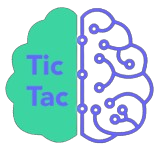

<h1 align="center"> Brain Tic Tac Toe</h1>

[View the live project here](https://ein-1.github.io/Brain-Tic-Tac-Toe/)

Brain Tic Tac Toe is a fun game played by two players, the player chooses to be X or O. Some times one can sense the next move by simply looking at the component's impression, by playing with a computer as your component, it's trickier and fun to play with a random move player because you can't see the computer's expressions.

The users of this game improves their virtue and focus skill in due time, because the more you play this game, the better your intellegence improves.

## Index – Table of Contents
* [Features](#features)
* [Design](#design)
* [Technologies Used](#technologies-used)
* [Testing](#testing)
* [Deployment](#deployment)
* [Credits](#credits)

## Features

### Existing Features

-   __Header__

    - The game consists of a logo on the left and center has the name:  Brain Tic Tac Toe in the center of the header which is good for user interface.
    - The logo and the name of the game clearly tells the user, that the game is for smart people.

      
      

-   __Make a choose__

    - The option box tells the player to choose from Prayer(O) or Prayer(O) before the game starts.
    - Once a user chooses a prayer, the game can only begin once the user clicks the button.

      

-   __Start game and Replay button__

    - Once the user wins, it pops a winner message, Tie or Try again if you lose then the game is over.
    - User can click replay button to re-start the game.
   
      

-   __Game results and Replay button__

     - The Replay button will take the user back to make option section and the user can choose who to be either X or O.
      

-   __Footer__

    - The Footer shows the rules of Brain Power Tic Tac Toe.
    - The footer clearly states the rules on how to ply the game, this is crucial to the user.

      

### Features which could be implemented in the future

- __future implementation__
    - I wish the loser could be the first one to play, once a replay button is placed given that on clicking replay one has to select who to be from player-X and player-O which I find tricky for now.

- __predication improvements__
    - When the first player starts from the corner he/she has higher chances of winning the game.
    - I could predict my win or the computer's next move even if it has to be random, not sure if it is just my intuition.

## Design

-   ### View
- It is in the middle of the screen
- the width of the elements is in percentage, so I didn't need to use media query in CSS for it to be responsive 

-   ### Colour Scheme
  

## Technologies Used

### Languages Used

-   [HTML5](https://en.wikipedia.org/wiki/HTML5)
-   [CSS3](https://en.wikipedia.org/wiki/Cascading_Style_Sheets)
-   [JavaScript](https://en.wikipedia.org/wiki/JavaScript)

### Libraries & Programs Used

-   [Google Fonts:](https://fonts.google.com/) was used to import the 'Familjen and Grotesk' fonts into the style.css file which are used in this project.
-   [Git:](https://git-scm.com/) was used for version control by utilising the Gitpod terminal to commit to Git and Push to GitHub.
-   [GitHub:](https://github.com/) is used as the respository for the projects code after being pushed from Git.
-   [iLoveIMG:](https://www.iloveimg.com/) was used for resizing images.
-   [favicon:](https://www.favicon.cc/) was used to add icon in the browser.
-   [logomaker:](https://www.logomaker.net/) was used to have a logo for aesthetic and UX purposes.
-   [remove image background](https://www.remove.bg/) was used to remove the logo background.
-   [mockup generator](https://ui.dev/amiresponsive?url=%20https://ein-1.github.io/Brain-Tic-Tac-Toe/) was used to test different screen responsive devices.

## Testing

- Lighthouse testing: 
  
- performance: 

### Validator Testing

- [HTML Validator](https://validator.w3.org/)

    - HTML Url checker
      
    - HTML input validator
      
    - HTML warning
      
    - The warning is caused by not have a headering in h2 but i wanted it blank.

- [CSS Validator](https://jigsaw.w3.org/css-validator/)

    - CSS results
      
      
    - There is only 1 warning and it is due to import of the Google fonts.

- [JavaScript Validator](https://jshint.com/)
  
    - JavaScript results
     
      
      
    - The warning was caused by jshint version 6 issues [jshint throwing warning](https://stackoverflow.com/questions/27441803/why-does-jshint-throw-a-warning-if-i-am-using-const) but was I put in jshint option it cleared as shown above.

  
### Browser Compatibility

    - Testing has been carried out on the following browsers :
    - Chrome (64-bit)
    - Firefox (64-bit)
    - Edge (64-bit)
  

## Deployment

### How this site was deployed

- In the GitHub repository, navigate to the Settings tab, then choose Pages from the left hand menu 
- From the source section drop-down menu, select the Master Branch
- Once the master branch has been selected, the page will be automatically refreshed with a detailed ribbon display to indicate the successful deployment
- Any changes pushed to the master branch will take effect on the live project

  The live link can be found here - [Brain Tic Tac Toe]( https://ein-1.github.io/Brain-Tic-Tac-Toe/) 

### How to clone the repository

- Go to the https://github.com/EIN-1/Brain-Tic-Tac-Toe repository on GitHub 
- Click the "Code" button to the right of the screen, click HTTPs and copy the link there
- Open a GitBash terminal and navigate to the directory where you want to locate the clone
- On the command line, type "git clone" then paste in the copied url and press the Enter key to begin the clone process
 
## Credits 
- javaScript : [code institute](https://youtu.be/n6gzxTsbHLc?si=aDJ1GpVS_6qi2efs)
- Code Hawk : [The Queen's Pawn](https://youtu.be/n6gzxTsbHLc?si=aDJ1GpVS_6qi2efs)
- A Complete Overview of JavaScript Events : [dcode](https://youtu.be/YiOlaiscqDY?si=wTdI2AmbCT6C8pmX)
- Game: [Bro Code](https://youtu.be/AnmwHjpEhtA?si=V_dSDNVMDIO-d6fQ)
- Color contrast : [matching colors](https://dequeuniversity.com/rules/axe/4.8/color-contrast)
- The jshint verson warnings : [JShint version issue](https://youtu.be/QDzeU1FUZRk?si=hFpzXqylDbD5_o7K)
- Jshint warning version issues : [stackoverflow](https://stackoverflow.com/questions/27441803/why-does-jshint-throw-a-warning-if-i-am-using-const)
- amiresponsive : [mockup generator](https://ui.dev/amiresponsive?url=%20https://ein-1.github.io/Brain-Tic-Tac-Toe/)

### Content 
- Content on the game was based on:
- [you tube](https://www.youtube.com/)
- [stackoverflow](https://stackoverflow.com/)
- [code institute](https://learn.codeinstitute.net)
- All other content was written by the developer.

### Code
- How to create a slider in CSS and JavaScript : [youtube videos on how to build tic tac toe](https://youtu.be/n6gzxTsbHLc?si=53Mkqg3-Gb_kX1qF)
- How to create tic tac toe videos from the ones I credited above : [youtube videos on how to build tic tac toe](https://www.youtube.com/)
- How to call functions : [code institute](https://codeinstitute.net)
- How to hide and show container element when i click the button :  [container hide and show](https://stackoverflow.com/questions/22242686/container-hide-and-show)
- How to munipulate some function to do specific tasks : [W3Schools The inner Element Object](https://www.w3schools.com/jsref/tryit.asp?filename=tryjsref_node_textcontent_innerhtml_innertext)

### Media 

- The fonts used were imported from [Google Fonts](https://fonts.google.com/)
- The favicon was created from [favicon](https://www.favicon.cc/)
- The logo was created using [logomaker](https://www.logomaker.net/)
- The logo image was resize using [iloveimg](https://www.iloveimg.com/)
- The logo background was removed using [remove image background](https://www.remove.bg/)

### Acknowledgments

- I want to thank my cohort facilitator madam Kay Welfare who always check up on me when am lost in my course and am grateful for giving me good advice and feedback on how to plan and execute this project and who provided me with lots of pointers on resources like where to look when looks for colors, resizing images and so on that helped me on this project.

- Thanks to code institute and staff for always providing me with important pointers and resourses to enable me wided my coding scope and knowlege.
- This readyME file was inspired by : [code institute - Rock,Paper,scissor](https://codeinstitute.net)
- This game was created as a project and it was a great experience making this game work

### Developed by 
- Elsie Nagawa 
  21.12.23
